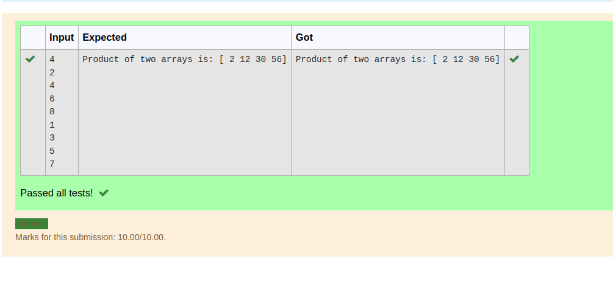

# Multiplying-two-matrix

## AIM:


To write a python program for multiplying two matrices.

## ALGORITHM:

### Step 1:
import numpy as np
### Step 2:
give the inputs
### Step 3:
use the for loop and range function
### Step 4:
multiply the two matrices

### Step 5:
check and verify the program

## PROGRAM: 
```python
'''Developed by:Saileshkumar A
Register number: 22003843
'''
import numpy as np
n=int(input())
l1=[]
l2=[]
for i in range(n):
    l1.append(int(input()))
for i in range(n):
    l2.append(int(input()))
a=np.array(l1)
b=np.array(l2)
product=a*b
print("Product of two arrays is:",product)
```

## OUTPUT:


## RESULT:
Python program for multiplying two matrices is successful.

